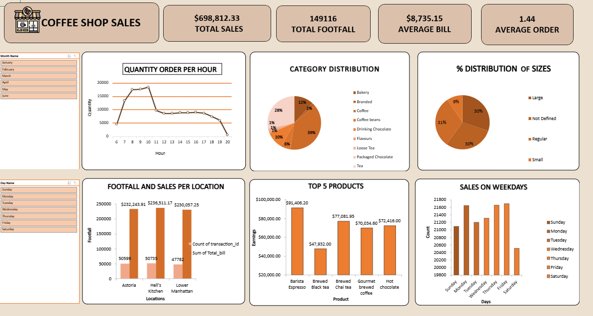

# ☕ Coffee Shop Sales Dashboard (Excel)

## 📊 Project Overview
This project presents an interactive Excel dashboard built to analyze the sales and customer behavior of a multi-location coffee shop. The goal was to derive actionable insights from transactional data to improve decision-making around operations, marketing, and product strategy.

---

## ❓ Problem Statement
Despite having a large volume of transaction data, the coffee shop lacked a consolidated view to understand:
- Peak sales periods during the day and week
- Most profitable product categories and items
- Footfall and revenue across locations
- Customer preferences in product sizes and offerings

---

## 🔍 Key Insights

- ⏰ **Peak Hours**: Sales peaked between **10 AM – 12 PM**, showing strong morning demand.
- 🥇 **Top Products**: `Barista Espresso`, `Brewed Chai Tea`, and `Hot Chocolate` contributed significantly to total revenue.
- 📍 **Store Analysis**: **Hell's Kitchen** had the highest total sales and footfall; **Lower Manhattan** had lower footfall but high average bills.
- 🥤 **Customer Preferences**: Majority of sales came from **Regular** and **Large** size beverages.
- 📆 **Day-wise Trends**: Highest sales occurred on **Thursday** and **Friday**, while **Saturday** saw the lowest.

---

## ✅ Business Outcomes

- **Operational Planning**: Schedule more staff during peak morning hours.
- **Product Focus**: Promote high-performing items like `Barista Espresso` across all locations.
- **Inventory Strategy**: Reduce focus on small-sized products due to lower preference.
- **Marketing Boost**: Introduce offers or loyalty programs for **Saturday** to improve weekend footfall.
- **Location-Specific Insights**: Investigate performance differences to balance store strategies.

---

## 🛠️ Tools Used
- Microsoft Excel
  - Pivot Tables
  - Slicers
  - Bar, Line & Pie Charts
  - Conditional Formatting & Dashboard Layout

---

## 📁 Files Included
- `coffee_shop_dashboard.xlsx` – The Excel dashboard file
- `screenshot.png` – Visual preview of the dashboard
- `README.md` – This project description

---

## 🙋‍♀️ About Me
I'm Merin Darlin, an analytics professional with a passion for creating business-focused dashboards and data insights.  
📫 [Connect with me on LinkedIn](https://www.linkedin.com/in/merin73)  

